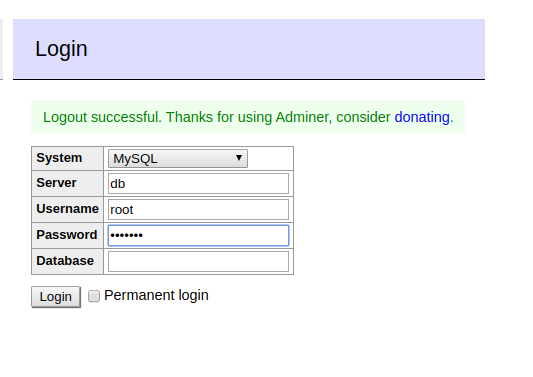

# Tutorial using MySQL with docker

In this tutorial we will show how easy it is to play with databases using docker

Each verison of MySQL has a different tag or label in docker and these can be found here on [Docker Hub](https://hub.docker.com/_/mysql?tab=tags)

We will also demonstrate the use of **Docker Compose** see official docs here - [https://docs.docker.com/compose/](https://docs.docker.com/compose/)

## Pull The image
you must first choose which version you want
```shell
docker pull mysql:5.7.30
```

## review the compose file
Notice we are create a spec that containes two separate docker containers that we want to talk to eachother on an internal private docker network. Notice we do not not need expose any ports on the database side only the database ui as the ui and database will talk on an internal network. If we want to access the database via jdbc we must expose the containers ports
```yaml
version: '3.1'

services:

  db:
    image: mysql:5.7.30
    command: --default-authentication-plugin=mysql_native_password
    restart: always
    ports:
      - 3306:3306
    environment:
      MYSQL_ROOT_PASSWORD: Password1
      MYSQL_DATABASE: deloitte
      MYSQL_USER: deloitteuser
      MYSQL_PASSWORD: deloittepassword


  adminer:
    image: adminer
    restart: always
    ports:
      - 8080:8080

```

## Now run the compose file
```shell
docker-compose up -d 
docker ps
```

## Test the database using the ui
navigate to http://localhost:8080/

The database name must match the name of the database service in the compose-file as this becomes like the dns name of the database IP address on the docker internal network

## Close eveything
```shell
docker-compose down -d 
docker ps
```

